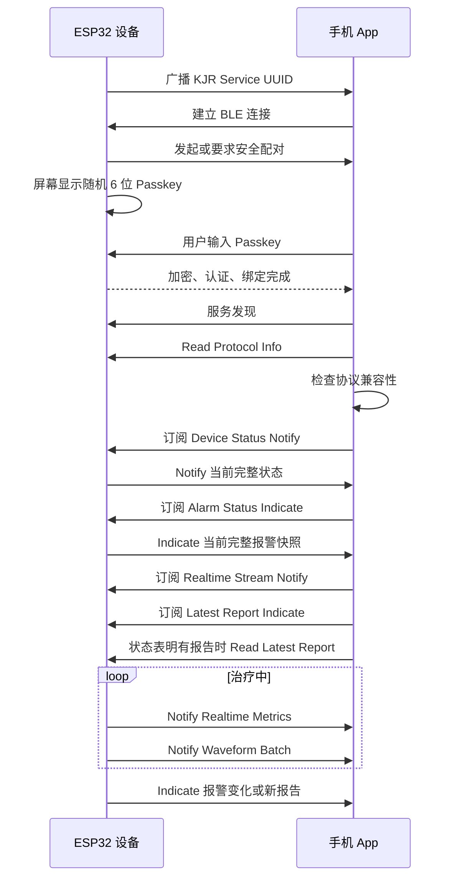

# 手机 App 蓝牙只读通信协议 V1.0

| 项目 | 内容 |
| --- | --- |
| 协议名称 | KJR BLE Read-only Protocol，简称 KBRP |
| 文档版本 | V1.0 Draft |
| 协议主版本 | 1 |
| 协议次版本 | 0 |
| 适用产品 | ESP32-S3 呼吸治疗设备及配套手机 App |
| 传输方式 | Bluetooth Low Energy GATT |
| 编制日期 | 2026-08-20 |
| 文档状态 | 可用于原型开发，量产前需完成文末待确认项 |

相关文档：

- [手机 App 蓝牙只读通信需求说明书](手机App蓝牙只读通信需求说明书.md)
- [低功耗蓝牙 BLE 入门指南](低功耗蓝牙BLE入门指南.md)

## 1. 协议目标

本协议用于手机 App 在设备附近通过 BLE 读取和接收以下数据：

- 设备型号、软件版本和协议能力。
- 当前运行状态、通气模式和设定压力。
- 实时治疗指标、压力波形和流量波形。
- 当前报警、故障及报警变化。
- 最近一次有效治疗报告。

本协议不允许 App 启停治疗、修改参数、校时、控制预加热、消音、复位报警、执行校准、升级固件或删除设备数据。

## 2. V1.0 设计结论

为使 App 和 ESP32 可以直接开始原型开发，V1.0 暂定以下规则：

| 项目 | V1.0 规则 |
| --- | --- |
| BLE 角色 | 设备为 Peripheral + GATT Server；App 为 Central + GATT Client |
| BLE Host | ESP-IDF NimBLE |
| 并发连接 | 1 个 App 连接 |
| 已绑定手机 | 暂定最多 1 部 |
| 业务写入 | 不提供任何自定义 Write/Write Without Response 特征 |
| 订阅写入 | 只允许 BLE 标准 CCCD 写入 |
| 安全方式 | LE Secure Connections、Bonding、MITM 防护 |
| 配对方式 | 设备显示 6 位随机 Passkey，用户在 App 输入 |
| 业务权限 | 完成认证和链路加密后才能 Read/Notify/Indicate |
| 数据格式 | 紧凑二进制，小端序，不传输 C 结构体内存 |
| 最小 MTU | 必须兼容 ATT MTU 23 |
| 推荐 MTU | 247；协商失败不影响基本通信 |
| 实时传输 | Metrics 每秒一次；波形默认 50 Hz 采样、每 5 点批量 Notify |
| 重要数据 | 报警和新报告使用 Indicate，并保留可 Read 快照 |
| 历史数据 | V1.0 不支持历史列表和分页同步 |
| 设备控制 | V1.0 不支持，能力位必须为 0 |

上述配对方式、绑定数量和波形速率仍需产品、App、算法和安全负责人在量产冻结前确认。协议字段已经保留兼容空间，调整这些产品策略不需要开放业务控制权限。

## 3. BLE 广播协议

### 3.1 广播条件

设备仅在以下条件全部满足时发送可连接广播：

1. 本机“数据传输”功能已开启。
2. 蓝牙协议栈初始化成功。
3. 当前没有手机连接。
4. 设备未处于禁止无线通信的安全或维护状态。

首次绑定必须由用户在设备本机进入配对模式。绑定完成后，设备可以为已绑定 App 广播并接受重连。清除绑定必须通过设备本机操作，App 无权远程清除。

### 3.2 广播参数

| 状态 | 建议广播间隔 | 持续时间 |
| --- | --- | --- |
| 本机配对模式 | 100～200 ms | 120 s，超时退出配对模式 |
| 已绑定、等待重连 | 500～1000 ms | 数据传输开启期间 |
| 已连接 | 停止可连接广播 | 直到断开 |

广播参数是产品实现建议，不属于应用层字节协议。最终值需经过功耗、连接速度和手机兼容性测试。

### 3.3 广播数据

Legacy Advertising Data 按以下顺序组织：

| AD Type | 内容 | 长度说明 |
| --- | --- | --- |
| Flags `0x01` | General Discoverable + BR/EDR Not Supported | 3 字节，包含 AD 长度和类型 |
| Complete List of 128-bit Service UUIDs `0x07` | KJR Read-only Service UUID | 18 字节 |
| Shortened Local Name `0x08` | `KJR-XXXX` | 10 字节，`XXXX` 为 4 字符设备短标识 |

以上总长度为 31 字节。设备不得在广播或扫描响应中发送完整序列号、治疗数据、报警内容或用户信息。

`KJR` 为当前产品族占位符，正式广播前应由产品确认。`XXXX` 必须是可供用户核对的短标识，不得直接等同于完整序列号或动态 BLE 地址。

## 4. GATT 服务定义

### 4.1 UUID 分配规则

本协议使用以下自定义 UUID 基础格式：

```text
7A3Cxxxx-6E4F-4B2D-9A10-52D8C1F0A201
```

其中 `xxxx` 标识 Service 或 Characteristic。UUID 使用规范字符串形式展示；ESP32 和 App 应通过各自 BLE API 创建 UUID，不得在业务代码中自行猜测空中传输字节顺序。

### 4.2 标准设备信息服务

Service UUID：`0000180A-0000-1000-8000-00805F9B34FB`，即 `0x180A`。

| Characteristic | UUID | Properties | Permission | Value |
| --- | --- | --- | --- | --- |
| Manufacturer Name | `0x2A29` | Read | Encrypted + Authenticated | UTF-8 厂商名称，待产品确认 |
| Model Number | `0x2A24` | Read | Encrypted + Authenticated | UTF-8 产品型号，当前来源 `APP_PARAM_MACHINE_MODEL` |
| Firmware Revision | `0x2A26` | Read | Encrypted + Authenticated | UTF-8 软件版本，当前来源 `APP_PARAM_SOFTWARE_VERSION` |

V1.0 不通过标准 Serial Number Characteristic 暴露完整序列号。

### 4.3 自定义只读治疗服务

Service UUID：`7A3C0000-6E4F-4B2D-9A10-52D8C1F0A201`。

| Characteristic | UUID | Properties | Permission | 允许的消息类型 |
| --- | --- | --- | --- | --- |
| Protocol Info | `7A3C0001-6E4F-4B2D-9A10-52D8C1F0A201` | Read | Encrypted + Authenticated | `0x01` |
| Device Status | `7A3C0002-6E4F-4B2D-9A10-52D8C1F0A201` | Read + Notify | Encrypted + Authenticated | `0x02` |
| Realtime Stream | `7A3C0003-6E4F-4B2D-9A10-52D8C1F0A201` | Notify | Encrypted + Authenticated | `0x03`、`0x04` |
| Alarm Status | `7A3C0004-6E4F-4B2D-9A10-52D8C1F0A201` | Read + Indicate | Encrypted + Authenticated | `0x05` |
| Latest Report | `7A3C0005-6E4F-4B2D-9A10-52D8C1F0A201` | Read + Indicate | Encrypted + Authenticated | `0x06` |

Notify/Indicate 特征由协议栈自动提供 CCCD `0x2902`。除此之外，不定义任何自定义可写 Descriptor 或 Characteristic。

CCCD 订阅值如下，均为 2 字节小端值：

| Characteristic | 订阅方式 | CCCD Value |
| --- | --- | --- |
| Device Status | Notify | `01 00` |
| Realtime Stream | Notify | `01 00` |
| Alarm Status | Indicate | `02 00` |
| Latest Report | Indicate | `02 00` |

App 应使用 Android/iOS BLE API 开启订阅，不应硬编码 CCCD Handle。CCCD 写入必须在安全连接完成后执行。

### 4.4 NimBLE 最低资源配置

协议实现至少需要满足：

| 配置项 | 最低要求 |
| --- | --- |
| 最大连接数 | 1 |
| 最大 Bond 数 | 1 |
| 最大 CCCD 数 | 4 |
| 最大 GATT 长属性值 | 512 字节，包含 8 字节 Transport Header |
| 最大 Message Body | 504 字节，包含 Payload 和 CRC16 |
| LE Secure Connections | 开启 |
| Bonding | 开启，并将密钥持久化 |
| MITM | 开启 |

具体 `menuconfig` 宏名以 ESP-IDF V5.3.5 实际菜单为准，不能只修改 `sdkconfig` 文本后假定配置已生效。

## 5. 连接与订阅流程



App 必须按以下顺序工作：

1. 连接并完成安全过程。
2. 发现服务，不缓存猜测的 Handle。
3. 读取 Protocol Info 并检查主版本、次版本兼容性。
4. 订阅 Device Status 和 Alarm Status。
5. 收到初始快照后再把页面标记为“数据已同步”。
6. 根据页面需要订阅 Realtime Stream。
7. 订阅 Latest Report；如果状态表明已有最近报告，再执行 Read。

每次重新连接都必须重新确认服务和 CCCD 状态。即使系统保存过订阅，App 也不能假定设备已经开始推送。

## 6. 基础编码规则

| 项目 | 规则 |
| --- | --- |
| 多字节整数 | 小端序，低字节在前 |
| 浮点数 | 禁止使用 IEEE Float，统一使用定点整数 |
| 字符串 | UTF-8，不包含结尾 `\0`，长度由 GATT Value 或字段定义 |
| 布尔值 | `0` 为 false，`1` 为 true，其他值非法 |
| 枚举 | 未定义值按 Unknown 处理，不得导致 App 崩溃 |
| 保留位 | 发送方必须置 0，接收方必须忽略 |
| 无效数值 | 优先使用 Valid Mask；没有 Valid Mask 的 `uint16` 使用 `0xFFFF` |
| 压力 | `uint16`，单位 0.1 cmH2O，与设备 UI 当前显示单位无关 |
| 流量 | `int16`，单位 0.1 L/min |
| 漏气量 | `uint16`，单位 0.1 L/min |
| 百分比 | `uint16`，单位 0.1% |
| 指数 | `uint16`，单位 0.1 次/小时 |
| 时长 | 明确使用 ms 或 s，不使用含糊的整数“秒”字段 |

发送方不得直接发送 C 结构体内存。所有字段必须按本文偏移逐个编码，接收方也必须逐字段解析。

## 7. 通用传输头与分片

### 7.1 Transport Packet 格式

每次 Read 返回值、Notify 或 Indicate 的 GATT Value 均由 8 字节传输头和一个数据片段组成：

| Offset | 长度 | 字段 | 类型 | 说明 |
| ---: | ---: | --- | --- | --- |
| 0 | 1 | `protocol_major` | `uint8` | V1.0 固定为 `1` |
| 1 | 1 | `message_type` | `uint8` | 消息类型，见第 8 章 |
| 2 | 2 | `sequence` | `uint16` | 同类逻辑消息序号，小端 |
| 4 | 1 | `fragment_index` | `uint8` | 当前分片序号，从 0 开始 |
| 5 | 1 | `fragment_count` | `uint8` | 总分片数，范围 1～255 |
| 6 | 2 | `total_length` | `uint16` | 完整 Message Body 长度，小端 |
| 8 | N | `fragment_data` | bytes | Message Body 的当前片段 |

`Message Body` 定义为：

```text
Message Body = Message Payload + CRC16
```

`total_length` 包含 2 字节 CRC16，但不包含 8 字节 Transport Header。

### 7.2 单片与多片

- 如果完整 Message Body 可以放入当前 GATT Value，`fragment_index=0`、`fragment_count=1`。
- Notify/Indicate 单包最大 Value 长度为 `ATT_MTU - 3`。
- 每个 Notify/Indicate 的最大 `fragment_data` 长度为 `ATT_MTU - 3 - 8`。
- ATT MTU 为 23 时，每片最多包含 12 字节 `fragment_data`。
- Read 可以使用 GATT Long Read。Read 返回完整值时仍设置 `fragment_count=1`，由 ATT Read Blob 完成链路层分段。
- 设备处理 Long Read 时，必须在本次完整读取期间缓存同一份不可变 Value；不能在不同 Read Blob Offset 请求之间重新生成 Sequence 或替换 Payload。

Notify/Indicate 分片数计算公式：

```text
fragment_data_capacity = ATT_MTU - 11
fragment_count = ceil(total_length / fragment_data_capacity)
```

V1.0 固定字段消息的典型大小如下：

| 消息 | Payload | Message Body | MTU 23 分片数 | MTU 247 分片数 |
| --- | ---: | ---: | ---: | ---: |
| Protocol Info Read | 24 | 26 | 1，使用 Long Read | 1 |
| Device Status | 20 | 22 | 2 | 1 |
| Realtime Metrics | 28 | 30 | 3 | 1 |
| Waveform Batch，5 点 | 28 | 30 | 3 | 1 |
| Alarm Status | 32 | 34 | 3 | 1 |
| Latest Report | 68 | 70 | 6 | 1 |

表中的 Message Body 已包含 2 字节 CRC，不包含 8 字节 Transport Header。

### 7.3 分片生成规则

1. 先生成完整 Message Payload。
2. 按第 7.5 节计算 CRC16，并追加到 Payload 尾部。
3. 根据当前 ATT MTU 计算每片最大数据长度。
4. 按顺序切分 Message Body。
5. 所有分片使用相同的 `protocol_major`、`message_type`、`sequence`、`fragment_count` 和 `total_length`。
6. `fragment_index` 从 0 递增到 `fragment_count - 1`。

### 7.4 重组规则

App 使用以下键区分正在重组的消息：

```text
(boot_id, message_type, sequence)
```

其中 `boot_id` 来自 Protocol Info。重组时必须检查：

- `fragment_count` 不为 0。
- `fragment_index < fragment_count`。
- 同一消息所有分片头公共字段一致。
- 所有分片拼接后长度等于 `total_length`。
- `total_length` 不超过 Protocol Info 声明的最大长度，且不超过 504 字节。
- CRC16 正确。

重复分片可覆盖相同 `fragment_index` 的旧副本；字段冲突、越界、超长、缺片或 CRC 错误时丢弃整条逻辑消息。

| 消息 | 重组超时 | 超时处理 |
| --- | --- | --- |
| Realtime Metrics | 500 ms | 丢弃，等待下一条 |
| Waveform Batch | 500 ms | 丢弃，等待下一条 |
| Device Status | 2 s | 丢弃并重新 Read |
| Alarm Status | 2 s | 丢弃并重新 Read |
| Latest Report | 5 s | 丢弃并重新 Read |

同一消息类型最多允许一条未完成消息。实时消息出现更大新序号时，可直接丢弃旧消息；Alarm 和 Report 必须完成当前 Indicate 消息后才能发送下一条。

### 7.5 CRC16

使用 CRC-16/CCITT-FALSE：

| 参数 | 值 |
| --- | --- |
| Polynomial | `0x1021` |
| Init | `0xFFFF` |
| RefIn | false |
| RefOut | false |
| XorOut | `0x0000` |
| 校验向量 | ASCII `123456789` 的结果为 `0x29B1` |

CRC 输入按以下顺序拼接：

```text
protocol_major(1 byte)
+ message_type(1 byte)
+ sequence(2 bytes, little-endian)
+ Message Payload
```

CRC 结果以小端序追加到 Payload 后。例如 CRC 为 `0xE8EA`，线上追加 `EA E8`。

### 7.6 Sequence

- 每种 `message_type` 维护独立的 16 位 Sequence。
- 设备每生成一条新的逻辑消息后加 1。
- Sequence 从 0 开始，达到 `65535` 后回绕到 0。
- 比较新旧时采用 16 位模运算；差值 `1～32767` 视为新消息。
- 设备重启后 Sequence 可重新从 0 开始，App 必须结合新的 `boot_id` 清理旧缓存。
- Report 去重以 64 位 `report_id` 为准，不以 Sequence 为准。

## 8. 消息类型

| Type | 名称 | Characteristic | 方向 | 频率/触发 |
| ---: | --- | --- | --- | --- |
| `0x01` | Protocol Info | Protocol Info | Device -> App Read | 每次连接读取 |
| `0x02` | Device Status | Device Status | Read/Notify | 订阅、状态变化、保活 |
| `0x03` | Realtime Metrics | Realtime Stream | Notify | 治疗中默认 1 Hz |
| `0x04` | Waveform Batch | Realtime Stream | Notify | 治疗中默认 10 条/s |
| `0x05` | Alarm Status | Alarm Status | Read/Indicate | 订阅、变化时 |
| `0x06` | Latest Report | Latest Report | Read/Indicate | 读取或新报告生成时 |
| `0x07～0x7F` | 保留 | - | - | 后续标准消息 |
| `0x80～0xFF` | 禁止使用 | - | - | 防止私有临时消息进入正式协议 |

## 9. Protocol Info，消息 `0x01`

### 9.1 Payload

| Offset | 长度 | 字段 | 类型 | 说明 |
| ---: | ---: | --- | --- | --- |
| 0 | 1 | `schema_version` | `uint8` | 当前为 `1` |
| 1 | 1 | `protocol_minor` | `uint8` | 当前为 `0` |
| 2 | 1 | `min_client_minor` | `uint8` | 可兼容的最低 App 次版本，当前为 `0` |
| 3 | 1 | `protocol_flags` | `uint8` | 见第 9.2 节 |
| 4 | 4 | `capability_flags` | `uint32` | 见第 9.3 节 |
| 8 | 4 | `boot_id` | `uint32` | 每次设备启动生成的新随机值 |
| 12 | 2 | `max_body_length` | `uint16` | 最大 Message Body 长度，V1.0 固定为 504 |
| 14 | 2 | `preferred_mtu` | `uint16` | 建议值 247 |
| 16 | 2 | `default_sample_period_ms` | `uint16` | 默认 20 ms |
| 18 | 1 | `default_samples_per_batch` | `uint8` | 默认 5 |
| 19 | 1 | `max_connections` | `uint8` | V1.0 固定为 1 |
| 20 | 4 | `short_device_id` | ASCII[4] | 广播名称中的 `XXXX`，不含 `\0` |

Payload 长度固定为 24 字节。

### 9.2 Protocol Flags

| Bit | 名称 | V1.0 |
| ---: | --- | --- |
| 0 | `ENCRYPTION_REQUIRED` | 1 |
| 1 | `AUTHENTICATION_REQUIRED` | 1 |
| 2 | `BONDING_REQUIRED` | 1 |
| 3 | `READ_ONLY_PROTOCOL` | 1 |
| 4～7 | Reserved | 0 |

### 9.3 Capability Flags

| Bit | 名称 | 说明 |
| ---: | --- | --- |
| 0 | `REALTIME_METRICS` | 支持实时治疗指标 |
| 1 | `PRESSURE_WAVEFORM` | 支持压力波形 |
| 2 | `FLOW_WAVEFORM` | 支持流量波形 |
| 3 | `ALARM_STATUS` | 支持当前报警快照 |
| 4 | `LATEST_REPORT` | 支持最近报告 |
| 5 | `SPO2` | 当前机型支持 SpO2 数据源 |
| 6 | `PULSE_RATE` | 当前机型支持脉率数据源 |
| 7 | `HUMIDIFIER_STATUS` | 支持加湿器状态 |
| 8 | `HEATED_TUBE_STATUS` | 支持加热管路状态 |
| 9 | `ALARM_LEVEL_MASKS` | 支持报警级别掩码 |
| 10～15 | Reserved | 发送 0 |
| 16 | `HISTORY_SYNC` | V1.0 必须为 0 |
| 17 | `DEVICE_CONTROL` | V1.0 必须为 0 |
| 18～31 | Reserved | 发送 0 |

### 9.4 兼容判断

App 按以下规则判断：

1. `protocol_major != 1`：不兼容，停止解析所有业务数据。
2. `App 支持的 minor < min_client_minor`：App 过旧，停止业务通信。
3. 设备 `protocol_minor` 高于 App 支持值，但 `min_client_minor` 允许：继续工作，忽略未知尾部字段和能力位。
4. `schema_version != 1`：V1.0 App 不解析该 Payload。
5. `DEVICE_CONTROL=1` 不代表 App 获得控制权限；V1.0 App 必须始终不发送业务写入。

## 10. Device Status，消息 `0x02`

### 10.1 Payload

| Offset | 长度 | 字段 | 类型 | 单位/说明 |
| ---: | ---: | --- | --- | --- |
| 0 | 1 | `schema_version` | `uint8` | 当前为 1 |
| 1 | 1 | `run_state` | `uint8` | 见第 10.2 节 |
| 2 | 1 | `ventilation_mode` | `uint8` | 见第 10.3 节 |
| 3 | 1 | `status_flags` | `uint8` | 见第 10.4 节 |
| 4 | 4 | `uptime_ms` | `uint32` | 本次启动运行毫秒数，回绕按无符号处理 |
| 8 | 4 | `epoch_time_s` | `uint32` | Unix 时间；RTC 无效时为 0 |
| 12 | 4 | `therapy_elapsed_s` | `uint32` | 本次治疗已运行秒数，未治疗时为 0 |
| 16 | 2 | `pressure_setting_1_x10` | `uint16` | 0.1 cmH2O；无效为 `0xFFFF` |
| 18 | 2 | `pressure_setting_2_x10` | `uint16` | 0.1 cmH2O；无效为 `0xFFFF` |

Payload 长度固定为 20 字节。

### 10.2 Run State

| 值 | 名称 | App 文案建议 |
| ---: | --- | --- |
| 0 | `STARTING` | 启动中 |
| 1 | `STANDBY` | 待机 |
| 2 | `PREHEATING` | 预加热 |
| 3 | `THERAPY` | 治疗中 |
| 4 | `FAULT` | 设备故障 |
| 5 | `SHUTTING_DOWN` | 正在停止 |
| 6～254 | Reserved | 未知状态 |
| 255 | `UNKNOWN` | 未知 |

### 10.3 Ventilation Mode

| 值 | 模式 |
| ---: | --- |
| 0 | Unknown/无有效模式 |
| 1 | CPAP |
| 2 | APAP |
| 3 | AUTO-B/VAuto |
| 4 | S |
| 5 | ST |
| 6～255 | Reserved，App 显示“未知模式” |

当前工程中 AUTO-B/VAuto、S/ST 的内部枚举存在不同命名，BLE 数据聚合层必须完成统一映射，不能把内部枚举值直接发送。

### 10.4 Status Flags

| Bit | 名称 | 说明 |
| ---: | --- | --- |
| 0 | `THERAPY_ACTIVE` | 当前治疗通气中 |
| 1 | `PREHEAT_ACTIVE` | 当前预加热中 |
| 2 | `SOURCE_DATA_VALID` | 下位机实时数据源有效 |
| 3 | `RTC_VALID` | `epoch_time_s` 有效 |
| 4 | `TUBE_INSERTED` | 加热管路已插入 |
| 5 | `WATER_TANK_HEATING` | 水箱加热中 |
| 6 | `TUBE_HEATING` | 管路加热中 |
| 7 | `LATEST_REPORT_AVAILABLE` | Latest Report 存在有效报告 |

### 10.5 压力设定值语义

| 模式 | Setting 1 | Setting 2 |
| --- | --- | --- |
| CPAP | 治疗压力 | `0xFFFF` |
| APAP | 最小治疗压力 | 最大治疗压力 |
| AUTO-B/VAuto | 最小呼气压力 EPAP | 最大吸气压力 IPAP |
| S/ST | 呼气压力 EPAP | 吸气压力 IPAP |
| Unknown | `0xFFFF` | `0xFFFF` |

### 10.6 发送时机

- Device Status Notify 订阅成功后立即发送完整快照。
- `run_state`、模式、Flags 或设定压力变化时立即发送。
- 治疗中即使无变化，每 5 秒发送一次保活快照。
- 待机时即使无变化，每 30 秒发送一次保活快照。
- App 超过 2 个保活周期未收到 Device Status，应把数据标记为过期。

## 11. Realtime Metrics，消息 `0x03`

### 11.1 Payload

| Offset | 长度 | 字段 | 类型 | 单位 |
| ---: | ---: | --- | --- | --- |
| 0 | 1 | `schema_version` | `uint8` | 当前为 1 |
| 1 | 1 | `reserved` | `uint8` | 发送 0，接收忽略 |
| 2 | 2 | `valid_mask` | `uint16` | 见第 11.2 节 |
| 4 | 4 | `sample_uptime_ms` | `uint32` | 指标采样时设备运行时间 |
| 8 | 2 | `pressure_x10` | `uint16` | 0.1 cmH2O |
| 10 | 2 | `flow_x10` | `int16` | 0.1 L/min |
| 12 | 2 | `leakage_x10` | `uint16` | 0.1 L/min |
| 14 | 2 | `tidal_volume_ml` | `uint16` | ml |
| 16 | 2 | `minute_ventilation_x10` | `uint16` | 0.1 L/min |
| 18 | 2 | `respiratory_rate_x10` | `uint16` | 0.1 次/min |
| 20 | 2 | `spo2_x10` | `uint16` | 0.1% |
| 22 | 2 | `pulse_rate_x10` | `uint16` | 0.1 bpm |
| 24 | 2 | `inspiratory_time_ms` | `uint16` | ms |
| 26 | 2 | `expiratory_time_ms` | `uint16` | ms |

Payload 长度固定为 28 字节。

### 11.2 Valid Mask

| Bit | 对应字段 |
| ---: | --- |
| 0 | `pressure_x10` |
| 1 | `flow_x10` |
| 2 | `leakage_x10` |
| 3 | `tidal_volume_ml` |
| 4 | `minute_ventilation_x10` |
| 5 | `respiratory_rate_x10` |
| 6 | `spo2_x10` |
| 7 | `pulse_rate_x10` |
| 8 | `inspiratory_time_ms` |
| 9 | `expiratory_time_ms` |
| 10～15 | Reserved，发送 0 |

Valid Mask 为 0 的字段必须被 App 视为无数据。发送方应把无效字段值置 0，但 App 不能把该 0 当作真实测量值。

### 11.3 发送规则

- 只在 `run_state=THERAPY` 且 Realtime Stream 已订阅时发送。
- 默认每 1000 ms 发送一次。
- 指标来源超过 2 秒没有更新时，清除对应 Valid Bit。
- App 超过 3 秒未收到 Metrics，应把实时数值标记为中断。

## 12. Waveform Batch，消息 `0x04`

### 12.1 Payload

| Offset | 长度 | 字段 | 类型 | 单位/说明 |
| ---: | ---: | --- | --- | --- |
| 0 | 1 | `schema_version` | `uint8` | 当前为 1 |
| 1 | 1 | `sample_count` | `uint8` | 本包采样点数，范围 1～10 |
| 2 | 2 | `sample_period_ms` | `uint16` | 相邻采样点时间间隔 |
| 4 | 4 | `first_sample_uptime_ms` | `uint32` | 第一个点的设备运行时间 |
| 8 | `4*N` | `samples[N]` | array | N 为 `sample_count` |

单个采样点格式：

| 相对 Offset | 长度 | 字段 | 类型 | 单位 |
| ---: | ---: | --- | --- | --- |
| 0 | 2 | `pressure_x10` | `uint16` | 0.1 cmH2O |
| 2 | 2 | `flow_x10` | `int16` | 0.1 L/min |

Payload 长度必须满足：

```text
payload_length = 8 + sample_count * 4
```

### 12.2 采样配置

| 模式 | Sample Period | Samples/Batch | 逻辑消息频率 | 适用条件 |
| --- | ---: | ---: | ---: | --- |
| Normal | 20 ms | 5 | 10 条/s | MTU 和手机性能满足要求 |
| Compatibility | 40 ms | 5 | 5 条/s | MTU 23、拥塞或手机性能不足 |

设备可以根据 MTU、发送队列和连接质量切换模式，但每条消息必须携带真实 `sample_period_ms`。App 只能按字段时间绘图，不得硬编码 20 ms。

### 12.3 发送与丢弃策略

- 只在治疗中并已订阅 Realtime Stream 时发送。
- 发送队列只保留有限数量波形，建议最多 3 条逻辑消息。
- 队列满时丢弃最旧波形，优先保证最新数据。
- 波形不得阻塞 Alarm、Device Status 和 Report。
- 任一分片丢失时 App 丢弃整批，不插入伪造的 0 值。

### 12.4 数据源要求

当前串口协议中的压力和流量原始单位尚未完全统一。BLE 实现前必须由下位机/算法负责人确认缩放关系，并由数据聚合层转换成本文规定的 0.1 cmH2O 和 0.1 L/min。未经确认不得直接把 A1 原始值作为 BLE 标准值发送。

## 13. Alarm Status，消息 `0x05`

### 13.1 Payload

| Offset | 长度 | 字段 | 类型 | 说明 |
| ---: | ---: | --- | --- | --- |
| 0 | 1 | `schema_version` | `uint8` | 当前为 1 |
| 1 | 1 | `alarm_flags` | `uint8` | 见第 13.2 节 |
| 2 | 1 | `turbine_code` | `uint8` | 0 无故障，非 0 为下位机故障码 |
| 3 | 1 | `storage_fault` | `uint8` | 见第 13.4 节 |
| 4 | 4 | `event_uptime_ms` | `uint32` | 本次快照生成时间 |
| 8 | 4 | `event_epoch_s` | `uint32` | Unix 时间；无效时为 0 |
| 12 | 4 | `active_mask` | `uint32` | 当前所有有效报警 |
| 16 | 4 | `changed_mask` | `uint32` | 相比上一条消息发生变化的报警 |
| 20 | 4 | `prompt_mask` | `uint32` | 当前提示级报警 |
| 24 | 4 | `warning_mask` | `uint32` | 当前警告级报警 |
| 28 | 4 | `critical_mask` | `uint32` | 当前严重级报警 |

Payload 长度固定为 32 字节。

### 13.2 Alarm Flags

| Bit | 名称 | 说明 |
| ---: | --- | --- |
| 0 | `TIME_VALID` | `event_epoch_s` 有效 |
| 1 | `SNAPSHOT` | 1 表示初始或 Read 完整快照 |
| 2 | `SOURCE_VALID` | 下位机报警数据源有效 |
| 3～7 | Reserved | 发送 0 |

### 13.3 Alarm Mask

| Bit | 报警 |
| ---: | --- |
| 0 | 系统泄漏 |
| 1 | 管路堵塞 |
| 2 | 管路脱落 |
| 3 | 压力过高 |
| 4 | 压力过低 |
| 5 | 呼吸频率过高 |
| 6 | 呼吸频率过低 |
| 7 | 潮气量过低 |
| 8 | 分钟通气量过低 |
| 9 | 窒息 |
| 10 | 加热盘故障 |
| 11 | 压力传感器故障 |
| 12 | 流量传感器故障 |
| 13 | 电源故障 |
| 14 | 水位低 |
| 15 | 水箱未安装 |
| 16 | 涡轮故障，详细码见 `turbine_code` |
| 17 | 存储空间不足 |
| 18 | 存储写入/文件系统故障 |
| 19～31 | Reserved |

`active_mask` 中每个有效 Bit 必须且只能出现在 `prompt_mask`、`warning_mask`、`critical_mask` 之一。没有完成报警等级安全评审前，设备可统一放入 `warning_mask`，App 不得自行提高或降低等级。

### 13.4 Storage Fault

| 值 | 状态 |
| ---: | --- |
| 0 | 无存储故障 |
| 1 | 存储空间不足 |
| 2 | 写入或文件系统故障 |
| 3～255 | Unknown/Reserved |

### 13.5 Snapshot 与 Change

- 订阅成功后的第一条 Indicate 和 Read 返回都必须设置 `SNAPSHOT=1`、`changed_mask=0`。
- 报警产生、解除或等级变化时，设置 `SNAPSHOT=0`，并在 `changed_mask` 标出所有变化 Bit。
- 无论是 Snapshot 还是 Change，`active_mask` 和三个等级 Mask 都必须包含当前完整状态，不能只发送变化部分。
- App 始终用最新完整 `active_mask` 替换旧状态，`changed_mask` 只用于动画、日志或提示。

### 13.6 发送规则

- 报警变化后目标 1 秒内发送。
- 分片 Indicate 必须逐片确认，整条 Alarm 完成前不得发送下一条 Alarm。
- 如果发送期间又发生变化，合并成下一条完整状态。
- 断开后 App 必须把报警页面标记为离线，不能把缓存状态当作当前状态。

## 14. Latest Report，消息 `0x06`

### 14.1 Payload

| Offset | 长度 | 字段 | 类型 | 单位/说明 |
| ---: | ---: | --- | --- | --- |
| 0 | 1 | `schema_version` | `uint8` | 当前为 1 |
| 1 | 1 | `report_flags` | `uint8` | 见第 14.2 节 |
| 2 | 1 | `ventilation_mode` | `uint8` | 同 Device Status |
| 3 | 1 | `end_reason` | `uint8` | 见第 14.4 节 |
| 4 | 4 | `valid_mask` | `uint32` | 见第 14.3 节 |
| 8 | 8 | `report_id` | `uint64` | 全设备范围内不重复的报告标识 |
| 16 | 4 | `start_epoch_s` | `uint32` | Unix 时间 |
| 20 | 4 | `end_epoch_s` | `uint32` | Unix 时间 |
| 24 | 4 | `duration_s` | `uint32` | 治疗时长，秒 |
| 28 | 2 | `ahi_x10` | `uint16` | 0.1 次/小时 |
| 30 | 2 | `hi_x10` | `uint16` | 0.1 次/小时 |
| 32 | 2 | `cai_x10` | `uint16` | 0.1 次/小时 |
| 34 | 2 | `oai_x10` | `uint16` | 0.1 次/小时 |
| 36 | 2 | `odi_x10` | `uint16` | 0.1 次/小时 |
| 38 | 2 | `inhale_p95_x10` | `uint16` | 0.1 cmH2O |
| 40 | 2 | `exhale_p95_x10` | `uint16` | 0.1 cmH2O |
| 42 | 2 | `average_pressure_x10` | `uint16` | 0.1 cmH2O |
| 44 | 2 | `average_leakage_x10` | `uint16` | 0.1 L/min |
| 46 | 2 | `average_spo2_x10` | `uint16` | 0.1% |
| 48 | 2 | `minimum_spo2_x10` | `uint16` | 0.1% |
| 50 | 2 | `average_pulse_rate_x10` | `uint16` | 0.1 bpm |
| 52 | 2 | `respiratory_rate_x10` | `uint16` | 0.1 次/min |
| 54 | 2 | `minute_ventilation_x10` | `uint16` | 0.1 L/min |
| 56 | 2 | `spont_trigger_x10` | `uint16` | 0.1% |
| 58 | 2 | `spont_cycle_x10` | `uint16` | 0.1% |
| 60 | 2 | `tidal_volume_ml` | `uint16` | ml |
| 62 | 2 | `inspiratory_time_ms` | `uint16` | ms |
| 64 | 2 | `expiratory_time_ms` | `uint16` | ms |
| 66 | 1 | `mask_fit` | `uint8` | 0 优秀，1 中等，2 不佳，255 未知 |
| 67 | 1 | `humidifier` | `uint8` | 0 正常，1 不佳，255 未知 |

Payload 长度固定为 68 字节。

### 14.2 Report Flags

| Bit | 名称 | 说明 |
| ---: | --- | --- |
| 0 | `HAS_REPORT` | 1 表示报告有效 |
| 1 | `TIME_VALID` | 开始和结束时间有效 |
| 2 | `INCOMPLETE` | 异常结束或数据不完整 |
| 3 | `RECOVERED_AFTER_REBOOT` | 报告由重启后存储恢复 |
| 4～7 | Reserved | 发送 0 |

当 `HAS_REPORT=0` 时，除 `schema_version` 和 `report_flags` 外的字段发送 0，App 不生成报告。

### 14.3 Report Valid Mask

| Bit | 有效字段或字段组 |
| ---: | --- |
| 0 | 开始时间、结束时间 |
| 1 | `duration_s` |
| 2 | AHI |
| 3 | HI |
| 4 | CAI |
| 5 | OAI |
| 6 | ODI |
| 7 | P95 吸气/呼气压力 |
| 8 | 平均压力 |
| 9 | 平均漏气量 |
| 10 | 平均/最低 SpO2 |
| 11 | 平均脉率 |
| 12 | 呼吸频率 |
| 13 | 分钟通气量 |
| 14 | 自主触发比例 |
| 15 | 自主切换比例 |
| 16 | 潮气量 |
| 17 | 吸气/呼气时间 |
| 18 | 面罩密封状态 |
| 19 | 加湿器状态 |
| 20～31 | Reserved |

### 14.4 End Reason

| 值 | 原因 |
| ---: | --- |
| 0 | Unknown |
| 1 | 用户在设备本机停止 |
| 2 | 设备自动停止 |
| 3 | 报警或故障导致停止 |
| 4 | 电源中断或重启后恢复的不完整报告 |
| 5～255 | Reserved |

### 14.5 Report ID

- `report_id` 必须在设备生命周期内保持唯一，不得因设备重启重复。
- 推荐使用持久化 64 位单调计数器，或由生产唯一标识、治疗开始信息和持久化会话计数组合生成。
- 同一报告无论 Read、重连还是重复 Indicate，必须保持相同 `report_id`。
- App 以设备身份和 `report_id` 的组合去重。
- 不得把容易推测的完整用户身份编码进 `report_id`。
- App 必须使用无符号 64 位整数、8 字节数组或 16 位十六进制字符串保存 `report_id`；JavaScript/JSON 实现不得用会丢失 64 位整数精度的 `Number` 类型保存。

### 14.6 发送规则

- 新治疗报告生成后，通过 Latest Report Indicate 发送。
- Indicate 分片必须按顺序逐片确认。
- 如果 App 未连接，设备保留最近一次有效报告；App 重连后通过 Read 获取。
- 旧报告不因每次重连自动 Indicate，避免重复提示。
- Device Status 的 `LATEST_REPORT_AVAILABLE` 指示是否值得执行 Read。
- V1.0 只提供最近一条报告，不提供历史列表。

## 15. 完整分片示例

以下示例展示 ATT MTU 23 时，一条 Device Status 如何拆成两片。

假设：

- Protocol Major：1。
- Message Type：`0x02`。
- Sequence：1。
- 状态：治疗中、CPAP。
- Flags：治疗中、数据源有效、RTC 有效、管路已插入，即 `0x1D`。
- Uptime：123456 ms。
- Unix 时间：1700000000。
- 治疗时长：3600 s。
- CPAP 治疗压力：10.0 cmH2O，即 100。
- Setting 2 无效。

Message Payload：

```text
01 03 01 1D 40 E2 01 00 00 F1 53 65 10 0E 00 00 64 00 FF FF
```

CRC 输入为：

```text
01 02 01 00
+ 01 03 01 1D 40 E2 01 00 00 F1 53 65 10 0E 00 00 64 00 FF FF
```

CRC16 结果为 `0xE8EA`，小端追加 `EA E8`。Message Body 共 22 字节：

```text
01 03 01 1D 40 E2 01 00 00 F1 53 65 10 0E 00 00 64 00 FF FF EA E8
```

MTU 23 时单片 `fragment_data` 最多 12 字节。

第一片 GATT Value，共 20 字节：

```text
01 02 01 00 00 02 16 00  01 03 01 1D 40 E2 01 00 00 F1 53 65
|----- Transport Header -----|  |---------- 12-byte data ----------|
```

第二片 GATT Value，共 18 字节：

```text
01 02 01 00 01 02 16 00  10 0E 00 00 64 00 FF FF EA E8
|----- Transport Header -----|  |-------- 10-byte data --------|
```

App 拼接两个 Data 片段，校验总长度 22 和 CRC，然后解析 20 字节 Device Status Payload。

## 16. 调度与优先级

发送优先级从高到低：

1. Alarm Status。
2. Device Status 状态变化。
3. Latest Report。
4. Realtime Metrics。
5. Waveform Batch。
6. Device Status 周期保活。

建议实现独立有界队列：

| 队列 | 建议深度 | 满队列策略 |
| --- | ---: | --- |
| Alarm/Status | 4 | 合并成最新完整状态，不静默丢失 |
| Report | 1 | 保留最近报告，等待发送或供 Read |
| Metrics | 2 | 丢弃旧值，保留最新值 |
| Waveform | 3 | 丢弃最旧批次 |

BLE 任务不得等待串口应答、访问慢速 SD 文件或直接操作 LVGL。数据源组件生成快照后投递给 BLE 队列，BLE 任务只负责编码、分片和发送。

## 17. 连接参数与吞吐量

### 17.1 推荐参数

| 状态 | Connection Interval | Peripheral Latency | Supervision Timeout |
| --- | --- | ---: | ---: |
| 治疗中 | 30～50 ms | 0 | 6 s |
| 待机 | 100～200 ms | 允许适度增加 | 6 s |

最终参数由手机 Central 决定，设备请求不一定被接受。App 和设备都不能把某个固定连接间隔作为解析协议的前提。

### 17.2 MTU 与波形策略

- Android 连接后建议请求 MTU 247。
- iOS 使用系统协商结果，不依赖特定数值。
- MTU 大于等于 64 时优先使用 Normal 波形模式。
- MTU 为 23 或发送拥塞时允许切换 Compatibility 模式。
- 即使 MTU 23，也必须能够接收状态、报警和报告。

### 17.3 发送失败

NimBLE Notify/Indicate API 返回失败时：

- 连接已断：停止发送，清理订阅和分片状态。
- 未订阅：不发送对应数据。
- 暂时无缓冲：按队列优先级延后或丢弃可覆盖实时数据。
- Indicate 未确认超时：终止当前发送；连接恢复后由 App Read 当前快照。

禁止在无限循环中无延时重试。

## 18. 安全协议

### 18.1 配对

1. 用户在设备本机进入 120 秒配对模式。
2. App 连接目标设备。
3. 设备生成随机 6 位 Passkey 并显示在本机屏幕。
4. 用户在 App 输入 Passkey。
5. 双方使用 LE Secure Connections 完成认证、加密和 Bonding。
6. 设备持久化绑定密钥，并退出配对模式。

固定 Passkey 只允许用于开发调试，量产固件禁止使用所有设备相同的固定 Passkey。

### 18.2 访问控制

- 未加密或未认证连接只能进行必要的 GAP/GATT 服务发现，不能读取任何业务 Value。
- 自定义业务特征对 Write 返回 ATT Write Not Permitted。
- 未认证读取返回 Insufficient Authentication 或 Insufficient Encryption。
- 只接受一个连接；已有连接时不接受第二个 App。
- 非配对模式下，未绑定手机的连接策略由安全实现限制，不能直接读取治疗数据。

### 18.3 绑定管理

- V1.0 暂定只保存一个手机 Bond。
- 新手机绑定前，用户必须在设备本机清除旧绑定。
- 清除绑定不删除治疗记录和设备参数。
- 设备恢复出厂设置时是否清除 Bond，由产品安全需求决定，但必须在 UI 明确提示。

### 18.4 隐私

- 广播不包含完整序列号、报告、报警或用户信息。
- 支持条件允许时启用 RPA，App 不依赖 BLE MAC 识别设备。
- App 本地保存报告前必须满足单独的数据隐私和留存需求。
- 日志不得输出 Passkey、长期密钥、完整报告或完整设备敏感标识。

## 19. App 解析状态机

```text
DISCONNECTED
  -> SCANNING
  -> CONNECTING
  -> SECURING
  -> DISCOVERING
  -> CHECKING_PROTOCOL
  -> SUBSCRIBING
  -> SYNCHRONIZING
  -> READY
  -> RECONNECTING / DISCONNECTED
```

| 状态 | App 行为 |
| --- | --- |
| SCANNING | 按 Service UUID 筛选，不只按名称 |
| SECURING | 完成配对或恢复加密绑定 |
| DISCOVERING | 发现 Service/Characteristic/CCCD |
| CHECKING_PROTOCOL | Read Protocol Info 并检查版本 |
| SUBSCRIBING | 逐个写 CCCD，检查系统返回结果 |
| SYNCHRONIZING | 等待 Device Status 和 Alarm 完整快照 |
| READY | 展示实时数据，处理过期和断线 |
| RECONNECTING | 停止把旧值标记为实时，指数退避重连 |

进入新的 `boot_id` 时，App 必须清理：

- 所有未完成分片。
- Sequence 比较基准。
- 实时指标和波形缓存。
- 设备状态和报警的“当前有效”标记。

Report 可以按 `report_id` 保留去重记录。

## 20. 设备状态机

```text
BLE_DISABLED
  -> ADVERTISING
  -> CONNECTED_UNSECURED
  -> SECURED
  -> SUBSCRIBED
  -> DISCONNECTED
  -> ADVERTISING
```

| 事件 | 设备处理 |
| --- | --- |
| 数据传输关闭 | 停止广告并断开 BLE；不影响治疗 |
| 建立连接 | 停止广告，记录连接 Handle |
| 安全失败 | 拒绝业务访问，必要时断开 |
| Status 订阅 | 立即发送 Device Status 快照 |
| Alarm 订阅 | 立即发送 Alarm Status 快照 |
| Realtime 订阅 | 仅治疗中开始实时流 |
| Report 订阅 | 只推送此后产生的新报告 |
| 断开 | 清理订阅、mbuf 和分片状态，按策略恢复广告 |
| BLE 异常 | 记录错误并恢复 BLE，不重启治疗业务 |

## 21. 错误处理

### 21.1 App 收到非法数据

| 错误 | 处理 |
| --- | --- |
| 未知 Message Type | 忽略并记录限频日志 |
| 主版本不兼容 | 停止业务解析，提示版本不支持 |
| Payload Schema 不支持 | 丢弃该消息，其他消息可继续 |
| 长度不符 | 丢弃整条逻辑消息 |
| CRC 错误 | 丢弃；状态/报警/报告可重新 Read |
| 缺片或超时 | 丢弃；实时等待下一条，重要数据重新 Read |
| 未知枚举 | 显示“未知”，保留原始值用于日志 |
| 保留位非 0 | 忽略该位，不因此拒绝整个消息 |

严格只读协议没有 App 到设备的业务错误上报通道。App 不得为了报告解析错误而向未知 Handle 写数据。

### 21.2 数据过期

| 数据 | 过期判断 |
| --- | --- |
| Device Status | 超过 2 个当前状态保活周期 |
| Realtime Metrics | 超过 3 秒 |
| Waveform | 超过 1 秒无完整批次 |
| Alarm Status | 断线立即标记为非实时；连接中超过 2 个 Status 保活周期时提示通信异常 |
| Latest Report | 报告本身不过期，但必须标明报告结束时间和连接来源 |

过期数据可以灰显或保留最后值，但必须明确标记，不能继续显示为当前实时数据。

## 22. ESP32 数据源映射

| BLE 数据 | 当前工程来源 | 转换要求 |
| --- | --- | --- |
| 型号 | `APP_PARAM_MACHINE_MODEL` | UTF-8 字符串 |
| 软件版本 | `APP_PARAM_SOFTWARE_VERSION` | UTF-8 字符串 |
| 通气状态 | `app_treatment_session_is_running()` | 聚合预加热、故障形成 Run State |
| 通气模式 | `app_params` | 映射成 BLE 枚举，不直传内部值 |
| 设定压力 | `app_params`、A1 设置值 | 统一成 0.1 cmH2O |
| 实时指标 | `serial_protocol_a1_packet_t` | 确认单位后转换并设置 Valid Mask |
| 压力/流量波形 | A1 `wave_points[5]` | 确认缩放，批量编码 |
| 报警 | A1 `alarm1/alarm2/turbine_alarm` | 合并为 32 位 Mask |
| 加热/管路状态 | A1 `heating_status` | 映射 Status Flags |
| 存储故障 | `app_treatment_storage_get_fault()` | 映射 Bit 17/18 和 Storage Fault |
| 最近报告 | `app_treatment_session_report_t`、`app_treatment_report_t` 和会话时间 | 聚合时间、指标并转换缩放和 Valid Mask |
| 累计/历史记录 | SD 卡治疗存储 | V1.0 不通过 BLE 提供 |

建议新增统一数据聚合组件，BLE 组件只读取线程安全快照。禁止 NimBLE 回调直接读取 LVGL 对象或阻塞等待串口命令。

## 23. 协议测试用例

### 23.1 GATT 权限

1. 未配对时读取每个业务特征，应被拒绝。
2. 配对加密后能够读取允许 Read 的特征。
3. 对五个自定义 Characteristic 尝试 Write，应全部返回 Write Not Permitted。
4. Notify/Indicate CCCD 可以正常开启和关闭。
5. 第二部手机不能同时建立业务连接。

### 23.2 版本和编码

1. Protocol Major 不匹配时 App 停止解析。
2. 未知次版本尾部字段不会导致崩溃。
3. 所有 16/32/64 位字段验证小端序。
4. 所有缩放系数验证边界、真实 0 和无效状态。
5. CRC 校验向量和第 15 章示例必须通过双方单元测试。

### 23.3 分片

1. 使用 MTU 23 验证所有消息。
2. 使用 MTU 247 验证单片和多片切换。
3. 注入缺片、重复片、乱序片、越界片和冲突头。
4. 注入 `total_length > 504`，双方不得溢出或崩溃。
5. Report 少一片时 App 不得生成半条报告。

### 23.4 状态与实时数据

1. 待机、预加热、治疗、停止和故障状态正确切换。
2. CPAP、APAP、AUTO-B、S、ST 压力设定语义正确。
3. Metrics 无效位不会被显示成数值 0。
4. Normal 和 Compatibility 波形时间轴正确。
5. 队列拥塞时报警仍优先，治疗任务无阻塞。

### 23.5 报警和报告

1. 逐项触发和解除 0～18 位报警。
2. Snapshot 与 Change 都携带完整 Active Mask。
3. 报警等级 Mask 不重叠且覆盖所有 Active Bit。
4. 报告重复 Indicate 或重复 Read 不产生重复记录。
5. 断线后生成报告，重连可通过 Read 获取。

### 23.6 稳定性与安全

1. 连续治疗传输至少 8 小时，无持续内存增长。
2. 反复连接/断开 1000 次，无崩溃和 Bond 异常。
3. 手机关闭蓝牙、杀进程、离开范围不影响设备治疗。
4. 弱信号和 2.4 GHz Wi-Fi 干扰下能够降级波形并保持报警可用。
5. 固件日志不泄露 Passkey、密钥或完整治疗报告。

## 24. 协议演进规则

### 24.1 兼容变更

以下变更可以增加 Protocol Minor：

- 在 Payload 尾部追加可选字段。
- 定义新的 Capability Bit。
- 定义新的 Message Type。
- 使用原保留枚举值增加状态。

旧 App 必须能根据长度忽略尾部字段和未知消息。

### 24.2 不兼容变更

以下变更必须增加 Protocol Major 或分配新的 Message Type/Characteristic：

- 改变已有字段偏移、宽度、符号、字节序或缩放。
- 重新解释已有枚举值或 Alarm Bit。
- 修改 CRC 算法或 Transport Header。
- 将只读特征改为可写业务特征。

### 24.3 UUID 变更

已经发布的 Service 和 Characteristic UUID 不得复用为不同语义。删除或改变特征语义时，应分配新 UUID 并保留清晰的迁移说明。

## 25. V1.0 明确不支持的内容

- App 启停治疗。
- App 修改任何设备参数。
- App 报警消音、确认或复位。
- App 校时。
- 历史报告列表、分页和断点续传。
- 固件升级和日志下载。
- App 业务 ACK 或解析错误回传。
- 多手机并发连接。
- 云端、远程控制或远程监护。

如果未来需要历史同步或 App 业务 ACK，必须新增经过权限和安全评审的受限请求特征，不能把控制命令混入 CCCD 或现有只读特征。

## 26. 量产冻结前待确认

| 编号 | 待确认项 | 当前协议默认值 | 影响 |
| --- | --- | --- | --- |
| P-001 | 产品广播族名称 | `KJR` | 广播名称和 App 筛选文案 |
| P-002 | 设备短标识生成规则 | 4 字符、非完整序列号 | 生产与隐私 |
| P-003 | 配对 UI 和 Passkey 流程 | 设备显示、App 输入 | UI、NimBLE IO Capability |
| P-004 | 是否只允许一个 Bond | 是 | 换机和售后流程 |
| P-005 | Android/iOS 最低版本 | 待定 | LE SC、后台和兼容测试 |
| P-006 | A1 压力/流量真实单位 | BLE 统一为 0.1 标准单位 | 所有实时数据正确性 |
| P-007 | Ti/Te 原始精度 | BLE 使用 ms | 数据转换和报告 |
| P-008 | AHI 等指数是否带小数 | BLE 使用 x10 | 报告转换 |
| P-009 | 报警等级映射 | 未评审前统一 Warning | 安全与 App 展示 |
| P-010 | 最近报告重启后恢复 | 建议从 SD 恢复 | Report Read 行为 |
| P-011 | 波形降级是否可接受 | MTU 23 时允许 25 Hz | App 曲线体验 |
| P-012 | RPA 与 Bond 密钥持久化方案 | 要求启用 | 安全实现 |

P-006～P-009 属于数据正确性和医疗安全关键项，未确认前只能用于联调占位，不能作为量产数据解释。

## 27. 实现完成定义

ESP32 与 App 同时满足以下条件，才可认为 KBRP V1.0 实现完成：

1. 所有 UUID、属性、权限和安全要求与本文一致。
2. 双方使用同一组编码/解码测试向量并全部通过。
3. MTU 23 和 MTU 247 下所有消息均能正确传输。
4. 自定义业务 Write 全部被拒绝，设备状态不发生变化。
5. 断线、重连、设备重启和 App 重启后的快照恢复正确。
6. 实时数据拥塞不会阻塞报警、治疗、串口、UI 和存储。
7. 报告去重和报警完整状态逻辑通过测试。
8. 安全、隐私、长稳和主流手机兼容测试通过。
9. 文末所有量产关键待确认项已关闭并更新到协议正式版。
